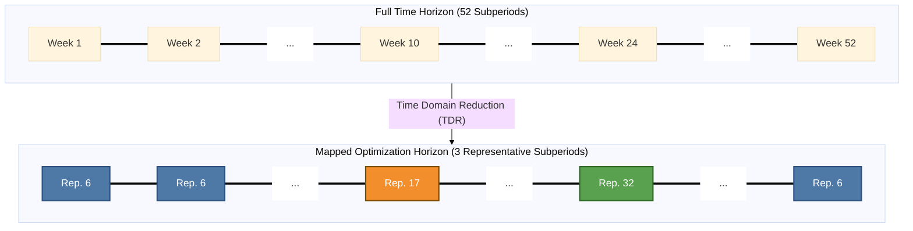

# Time Data

## Contents

[Overview](@ref "manual-timedata-overview") | [TimeData Struct](@ref "manual-timedata-struct") | [Input File](@ref "manual-timedata-input") | [Subperiod Weights](@ref "manual-timedata-weights") | [Period Map](@ref "manual-timedata-periodmap") | [Key Functions](@ref "manual-timedata-functions") | [Example](@ref "manual-timedata-examples") | [Reconstructing Full Time Series](@ref "manual-timedata-reconstruction")

## [Overview](@id manual-timedata-overview)

Time data controls how Macro discretizes, represents, and weights time in an optimization model. Every node, edge, transformation, and storage component in a Macro system carries a `TimeData` object that defines its temporal resolution.

### Key Concepts

- **Time interval**: The full set of time steps in the simulation, determined by `NumberOfSubperiods × HoursPerSubperiod`.
- **Time step**: The smallest unit of time in the model for a given commodity. Currently fixed at 1 hour (`HoursPerTimeStep = 1`).
- **Subperiod**: A contiguous block of time steps (e.g., one representative week). Subperiods are used for time-wrapping in storage and other time-coupling constraints, as well as in the Benders decomposition algorithm.
- **Representative subperiods**: When the modeled time horizon is shorter than the full year, Macro uses a **period map** to assign each subperiod to a representative subperiod. This reduces the computational burden of the model optimization and enables efficient modeling of a full year using only a few representative weeks or days.
- **Subperiod weights**: Scaling factors that adjust operational costs and quantities so that a few representative subperiods correctly approximate the full modeled horizon.

The diagrams below illustrate how a continuous time series is partitioned into blocks (subperiods) and represented in the model. 

### Process Overview

A full time horizon (e.g., a year) is divided into sequential subperiods. The Time Domain Reduction (TDR) process maps each subperiod to a representative period to reduce down the number of periods modeled. The **weight** of each representative reflects how many subperiods of the timeline it stands in for.



| Week | 1 | 2 | 3 | … | 10 | 11 | … | 24 | … | 52 |
|:---:|:---:|:---:|:---:|:---:|:---:|:---:|:---:|:---:|:---:|:---:|
| Maps to | Wk 6 | Wk 6 | Wk 6 | … | Wk 17 | Wk 6 | … | Wk 32 | … | Wk 6 |

### Input Files and Internal Representation

Like all other data in Macro, time data has two sides: the **input files** the user provides, and the **internal representation** Macro constructs from them.
1. Two **input files** (`time_data.json` and `Period_map.csv`) that the user provides to define the time configuration of the system (user interface).
2. The **internal `TimeData` struct** that Macro constructs from the input files and uses to access time information throughout the modeling process (internal representation).

## [TimeData Struct](@id manual-timedata-struct)

Internally, Macro stores the processed time configuration in a `TimeData{T}` struct, parameterized by the commodity type `T`.

### Fields

| **Field** | **Type** | **Description** |
|:---|:---|:---|
| `time_interval` | `StepRange{Int64,Int64}` | Full range of time steps (e.g., `1:504`). |
| `hours_per_timestep` | `Int64` | Hours represented by each time step. |
| `period_index` | `Int64` | Index of the current planning period (used in multi-period models). Default: `1`. |
| `subperiods` | `Vector{StepRange{Int64,Int64}}` | List of time step ranges for each subperiod (e.g., `[1:168, 169:336, 337:504]`). |
| `subperiod_indices` | `Vector{Int64}` | Unique subperiod indices of the representative periods (e.g., `[6, 17, 32]`). |
| `subperiod_weights` | `Dict{Int64,Float64}` | Weight for each representative subperiod, keyed by its `Rep_Period` value (e.g., `{6 => 18.05, 17 => 21.06, 32 => 13.04}`). |
| `subperiod_map` | `Dict{Int64,Int64}` | Maps each subperiod index to its representative subperiod index (e.g., `{1 => 6, 2 => 6, 3 => 6, ..., 10 => 17, 11 => 6, 24 => 32, 52 => 6}`). |

### Type hierarchy

`TimeData{T}` is a subtype of `AbstractTimeData{T}`, where `T` is any `Commodity` type (e.g., `Electricity`, `Hydrogen`).

## [Input File: `time_data.json`](@id manual-timedata-input)

**Format**: JSON

The `time_data.json` file is located in the `system/` folder and defines the temporal structure for all commodities. It is referenced in the [`system_data.json`](@ref "manual-system-data-structure") file.

### Structure

```json
{
    "NumberOfSubperiods": <Integer>,
    "HoursPerTimeStep": {
        "Commodity_1": <Integer>,
        "Commodity_2": <Integer>
    },
    "HoursPerSubperiod": {
        "Commodity_1": <Integer>,
        "Commodity_2": <Integer>
    },
    "SubPeriodMap": {
        "path": "<relative path to Period_map.csv>"
    },
    "TotalHoursModeled": <Integer>
}
```

### Attributes

| **Attribute** | **Type** | **Required** | **Default** | **Description** |
|:---|:---:|:---:|:---:|:---|
| `NumberOfSubperiods` | Integer | Yes | — | Number of representative subperiods in the simulation (e.g., 3 representative weeks). |
| `HoursPerTimeStep` | Dict | Yes | 1 | Number of hours per time step **for each commodity**. Must be `1` for now (sub-hourly and multi-hour time steps are not yet supported). |
| `HoursPerSubperiod` | Dict | Yes | — | Number of hours in each subperiod **for each commodity** (e.g., 168 for a week, 24 for a day). |
| `SubPeriodMap` | Dict | No | Identity map | Path to the period map CSV file or inline data. If omitted, each subperiod maps to itself and weights are scaled by `TotalHoursModeled`. |
| `TotalHoursModeled` | Integer | No | 8760 | Total hours the model represents (typically 8760 for one year). Used to compute subperiod weights when representative periods are used. |

!!! note "Commodity inheritance"
    Time data entries are matched to commodities by name. If a commodity (e.g., a user-defined sub-commodity) does not have an explicit entry in `HoursPerTimeStep` or `HoursPerSubperiod`, Macro will search the commodity's supertype hierarchy for a matching entry (e.g., `Electricity` for a sub-commodity of `Electricity`).

### How the time interval is computed

The total number of time steps for each commodity is:

```math
\text{TimeInterval} = 1 : (\texttt{NumberOfSubperiods} \times \texttt{HoursPerSubperiod})
```

The time interval is then partitioned into `NumberOfSubperiods` contiguous subperiods, each of length `HoursPerSubperiod`.

## [Period Map](@id manual-timedata-periodmap)

The **period map** links the full-year time horizon to the representative subperiods used in the optimization. It is provided as a CSV file (typically `Period_map.csv`) and referenced via the `SubPeriodMap` field in `time_data.json`:

```json
"SubPeriodMap": {
    "path": "system/Period_map.csv"
}
```

The **period map** allows Macro to:
1. **Compute subperiod weights**: scale operational costs and flows so that a few representative subperiods correctly approximate the full modeled time horizon (see [Subperiod Weights](@ref "manual-timedata-weights")).
2. **Model long-duration storage**: track storage state-of-charge across subperiod boundaries by identifying which subperiods are represented by the same representative subperiod.
3. **Run Benders decomposition**: group all modeled subperiods that share a representative into the same operational subproblem, reducing the number of subproblems solved.

### Format

The CSV file must have exactly three columns:

| **Column** | **Type** | **Description** |
|:---|:---:|:---|
| `Period_Index` | Integer | Index of the subperiod in the full time horizon (e.g., week 1 to 52 in a year). |
| `Rep_Period` | Integer | Index of the representative subperiod in the original time series that this subperiod is assigned to. |
| `Rep_Period_Index` | Integer | 1-based index of the representative subperiod as it appears in the modeled time horizon (matches the subperiod ordering in `time_data.json`). |

## [Subperiod Weights](@id manual-timedata-weights)

When representative periods are used, Macro computes a **weight** for each subperiod so that operational costs and energy quantities are correctly scaled to represent the full modeled horizon.

### Weight formula

The weight for the $i$-th representative period is:

```math
w_i = \alpha \cdot n_i
```

where $n_i$ is the number of times the $i$-th representative period appears in the period map, and $\alpha$ is a scaling factor:

```math
\alpha = \frac{\texttt{TotalHoursModeled}}{\sum_{i=1}^{N} \texttt{HoursPerSubperiod} \cdot n_i}
```

where $N$ is the total number of **unique** representative periods.

### Interpretation

- ``n_i`` counts how many subperiods are assigned to the $i$-th representative subperiod. A representative week assigned to 18 of the 52 subperiods has $n_i = 18$.
- ``\alpha`` rescales the weights so that the total weighted hours equal `TotalHoursModeled`. This accounts for any mismatch between the sum of mapped periods and the target time horizon.
- The weight $w_i$ is applied to each hour within the $i$-th subperiod when summing operational costs and flows.

See the [Examples](@ref "manual-timedata-examples") section for a worked weight calculation.

!!! tip "Weights without a period map"
    If no `SubPeriodMap` is provided in `time_data.json`, Macro assumes each subperiod maps to itself (identity mapping). Weights are computed using the same formula with $n_i = 1$ for each subperiod, giving $w_i = \texttt{TotalHoursModeled} / (\texttt{NumberOfSubperiods} \times \texttt{HoursPerSubperiod})$. This equals 1 only when `TotalHoursModeled` matches the total modeled hours exactly.

## [Key Functions](@id manual-timedata-functions)

The following functions provide quick access to time data information from vertices and edges (`y`) in the system:

| **Function** | **Description** |
|:---|:---|
| `time_interval(y)` | Returns the full time interval for component `y`. |
| `hours_per_timestep(y)` | Returns the number of hours per time step. |
| `subperiods(y)` | Returns the list of subperiod ranges. |
| `subperiod_indices(y)` | Returns the unique representative period indices. |
| `subperiod_weight(y, w)` | Returns the weight for representative period `w`. |
| `subperiod_map(y)` | Returns the full period map dictionary. |
| `current_subperiod(y, t)` | Returns the subperiod index containing time step `t`. |
| `get_subperiod(y, w)` | Returns the time step range for representative period `w`. |

### [`timestepbefore`](@ref)

The [`timestepbefore`](@ref) function computes the time step that is `h` steps before index `t` with **circular indexing** within a subperiod. This is critical for time-coupling constraints such as storage state-of-charge tracking, where the last time step of a subperiod wraps around to the first.

## [Example](@id manual-timedata-examples)

### 52 weeks with 3 representative weeks and period map

Model a full year (52 weeks) using 3 representative weeks (weeks 6, 17, and 32), with hourly resolution.

**`time_data.json`:**

```json
{
    "NumberOfSubperiods": 3,
    "HoursPerTimeStep": {
        "Electricity": 1,
        "Hydrogen": 1,
        "NaturalGas": 1,
        "CO2": 1,
        "Uranium": 1
    },
    "HoursPerSubperiod": {
        "Electricity": 168,
        "Hydrogen": 168,
        "NaturalGas": 168,
        "CO2": 168,
        "Uranium": 168
    },
    "SubPeriodMap": {
        "path": "system/Period_map.csv"
    },
    "TotalHoursModeled": 8760
}
```

**`Period_map.csv`** (excerpt):

| Period\_Index | Rep\_Period | Rep\_Period\_Index |
|:---:|:---:|:---:|
| 1 | 6 | 1 |
| 2 | 6 | 1 |
| 3 | 6 | 1 |
| ... | ... | ... |
| 10 | 17 | 2 |
| 11 | 6 | 1 |
| ... | ... | ... |
| 24 | 32 | 3 |
| ... | ... | ... |
| 52 | 6 | 1 |

Each of the 52 weeks is assigned to one of 3 representative weeks (6, 17, or 32). This produces:
- **Time interval**: `1:504` (3 × 168 = 504 time steps)
- **Subperiods**: `[1:168, 169:336, 337:504]`
- **`subperiod_map`**: `{1 => 6, 2 => 6, 3 => 6, ..., 10 => 17, 11 => 6, ..., 24 => 32, ..., 52 => 6}`
- **`subperiod_indices`**: `[6, 17, 32]`

**Weight calculation**: with $n_1 = 18$ (week 6 represents 18 of the 52 weeks), $n_2 = 21$ (week 17), and $n_3 = 13$ (week 32):

```math
\alpha = \frac{8760}{168 \times (18 + 21 + 13)} = \frac{8760}{168 \times 52} = \frac{8760}{8736} \approx 1.00275
```

| Rep\_Period\_Index | Rep\_Period | $n_i$ | $w_i = \alpha \cdot n_i$ |
|:---:|:---:|:---:|:---:|
| 1 | 6 | 18 | ≈ 18.05 |
| 2 | 17 | 21 | ≈ 21.06 |
| 3 | 32 | 13 | ≈ 13.04 |

Each hour in representative week 6, for instance, counts as approximately 18.05 hours in the objective function, since it represents 18 of the 52 real-world weeks.

## [Reconstructing Full Time Series from Model Output](@id manual-timedata-reconstruction)

When TDR is used, the optimization runs over only the representative subperiods (e.g., 3 weeks × 168 hours = 504 time steps), so raw model outputs — dispatch, storage levels, flows — are indexed over those time steps only. Macro automatically reconstructs the full-year time series by using the period map to copy each representative subperiod's output to every original subperiod it stands in for.

For each row `(Period_Index, Rep_Period, Rep_Period_Index)` in `Period_map.csv`, Macro reads the model output for `Rep_Period_Index` (time steps `(Rep_Period_Index - 1) × HoursPerSubperiod + 1` through `Rep_Period_Index × HoursPerSubperiod`) and writes it as the output for week `Period_Index` of the full year.

### Example

Using the 52-week example above, the model output covers 504 time steps indexed as:

| `Rep_Period_Index` | `Rep_Period` | Model time steps |
|:---:|:---:|:---:|
| 1 | 6 | 1–168 |
| 2 | 17 | 169–336 |
| 3 | 32 | 337–504 |

while the full year has 52 weeks indexed as:

| `Period_Index` | `Rep_Period` | Full year time steps |
|:---:|:---:|:---:|
| 1 | 6 | 1–168 |
| 2 | 6 | 1–168 |
| 3 | 6 | 1–168 |
| ... | ... | ... |
| 10 | 17 | 169–336 |
| 11 | 6 | 1–168 |
| ... | ... | ... |
| 24 | 32 | 337–504 |
| ... | ... | ... |
| 52 | 6 | 1–168 |

To reconstruct week 11 of the full year (`Period_Index = 11`, `Rep_Period = 6`, `Rep_Period_Index = 1`), Macro copies model time steps 1–168. To reconstruct week 24 (`Rep_Period_Index = 3`), Macro copies time steps 337–504, and so on.