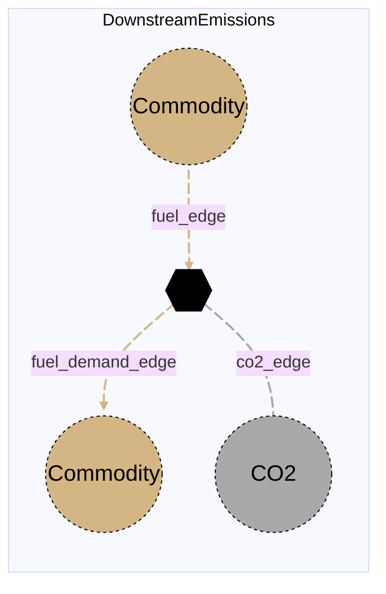

# Downstream Emissions

## Contents

[Overview](@ref downstreamemissions_overview) | [Asset Structure](@ref downstreamemissions_asset_structure) | [Flow Equations](@ref downstreamemissions_flow_equations) | [Input File (Standard Format)](@ref downstreamemissions_input_file) | [Types - Asset Structure](@ref downstreamemissions_type_definition) | [Constructors](@ref downstreamemissions_constructors) | [Examples](@ref downstreamemissions_examples) | [Best Practices](@ref downstreamemissions_best_practices) | [Input File (Advanced Format)](@ref downstreamemissions_advanced_json_csv_input_format)

## [Overview](@id downstreamemissions_overview)

Downstream emissions assets in Macro represent end-use commodity consumption processes at the downstream end of a value chain. They take in a commodity from the modeled system, pass that commodity to a demand or consuming node, and emit CO2 according to an `emission_rate`. These assets are defined using either JSON or CSV input files placed in the `assets` directory, typically named with descriptive identifiers like `downstreamemissions.json` or `downstreamemissions.csv`.

This asset is intended for cases where the commodity is routed to an external node that already exists in the system, including cases where several assets share the same downstream demand node. In other words, `DownstreamEmissions` adds emissions to a shared downstream node rather than owning a dedicated demand node internally.

The current implementation is generic over commodity type, so the same asset can represent downstream emissions from liquid fuels, natural gas, or other commodities supported by the model.

This distinction is important relative to the planned `DownstreamUse` asset: `DownstreamEmissions` routes flow to an external node via `fuel_demand_end_vertex`, whereas `DownstreamUse` is intended for cases where the asset itself will include a demand node.

For backward compatibility, `DownstreamUse` and `FuelsEndUse` remain available as aliases of `DownstreamEmissions`.

## [Asset Structure](@id downstreamemissions_asset_structure)

A downstream emissions asset consists of four main components:

1. **Transformation Component**: Balances commodity throughput and emissions
2. **Fuel Edge**: Represents the incoming commodity flow from the modeled system
3. **Fuel Demand Edge**: Represents the outgoing commodity flow to an external end-use or demand node
4. **CO2 Edge**: Represents emitted CO2 sent to a sink or location

`DownstreamEmissions` does not create its own node. The outgoing `fuel_demand_edge` must connect to a node that is already defined elsewhere in the system.

Here is a graphical representation of the downstream emissions asset:



## [Flow Equations](@id downstreamemissions_flow_equations)

The downstream emissions asset follows these relationships:

```math
\begin{aligned}
\text{flow}_{fuel\_demand} &= \text{flow}_{fuel} \\
\text{flow}_{co2} &= \text{flow}_{fuel} \cdot \epsilon_{emission\_rate}
\end{aligned}
```

Where:
- ``flow`` represents the flow of each commodity
- ``\epsilon`` represents the emission coefficient defined in the [Conversion Process Parameters](@ref downstreamemissions_conversion_process_parameters) section

## [Input File (Standard Format)](@id downstreamemissions_input_file)

The easiest way to include a downstream emissions asset in a model is to create a new file (either JSON or CSV) and place it in the `assets` directory together with the other assets.

Because this asset does not contain its own demand node, the `fuel_demand_end_vertex` should point to an existing node in `nodes.json` or to another node created elsewhere in the case definition.

```text
your_case/
├── assets/
│   ├── downstreamemissions.json    # or downstreamemissions.csv
│   ├── other_assets.json
│   └── ...
├── system/
├── settings/
└── ...
```

This file can either be created manually, or using the `template_asset` function, as shown in the [Adding an Asset to a System](@ref) section of the User Guide. The file will be automatically loaded when you run your Macro model.

The following is an example of a downstream emissions asset input file:

```json
{
    "downstream_emissions": [
        {
            "type": "DownstreamEmissions",
            "instance_data": [
                {
                    "id": "liquid_fuels_use_SE",
                    "location": "SE",
                    "fuel_commodity": "LiquidFuels",
                    "fuel_demand_commodity": "LiquidFuels",
                    "fuel_demand_end_vertex": "liquid_fuels_demand_SE",
                    "emission_rate": 0.25,
                    "fuel_demand_investment_cost": 2500,
                    "fuel_demand_fixed_om_cost": 100,
                    "fuel_demand_variable_om_cost": 2.0,
                    "co2_sink": "co2_atm_SE"
                }
            ]
        }
    ]
}
```

!!! tip "Global Data vs Instance Data"
    When working with JSON input files, the `global_data` field can be used to group data that is common to all instances of the same asset type. This is useful for setting constraints that are common to all instances of the same asset type and avoid repeating the same data for each instance. See the [Examples](@ref "downstreamemissions_examples") section below for an example.

The following tables outline the attributes that can be set for a downstream emissions asset.

### Essential Attributes

| Field | Type | Description |
|--------------|---------|------------|
| `type` | String | Asset type identifier: "DownstreamEmissions" |
| `id` | String | Unique identifier for the downstream emissions instance |
| `location` | String | Geographic location/node identifier |

### [Conversion Process Parameters](@id downstreamemissions_conversion_process_parameters)

| Field | Type | Description | Units | Default |
|--------------|---------|------------|----------------|----------|
| `emission_rate` | Float64 | CO2 emissions per unit of incoming commodity throughput | commodity-dependent | 0.0 |
| `fuel_commodity` | String | Commodity consumed by the `fuel_edge` | - | `"LiquidFuels"` |
| `fuel_demand_commodity` | String | Commodity delivered by the `fuel_demand_edge` | - | `"LiquidFuels"` |
| `fuel_demand_end_vertex` | String | End vertex for the outgoing demand edge | - | missing |
| `co2_sink` | String | End vertex for emitted CO2 | - | missing |
| `timedata` | String | Time series key used for the transformation and commodity edges | - | `"LiquidFuels"` |

Simple-format edge attributes use edge-specific prefixes. For example, incoming commodity edge fields are written as `fuel_investment_cost`, `fuel_existing_capacity`, and `fuel_constraints`; outgoing demand edge fields use the `fuel_demand_` prefix; and CO2 edge fields use the `co2_` prefix.

### [Constraints Configuration](@id "downstreamemissions_constraints")

Downstream emissions assets can have different constraints applied to them, and the user can configure them using the following fields:

| Field | Type | Description |
|--------------|---------|------------|
| `transform_constraints` | Dict{String,Bool} | List of constraints applied to the transformation component. |
| `fuel_constraints` | Dict{String,Bool} | List of constraints applied to the incoming commodity edge. |
| `fuel_demand_constraints` | Dict{String,Bool} | List of constraints applied to the outgoing demand edge. |
| `co2_constraints` | Dict{String,Bool} | List of constraints applied to the CO2 edge. |

Users can refer to the [Adding Asset Constraints to a System](@ref) section of the User Guide for a list of all the constraints that can be applied to a downstream emissions asset.

#### Default constraints

To simplify the input file and the asset configuration, the following constraints are applied to the downstream emissions asset by default:

- [Balance constraint](@ref balance_constraint_ref) (applied to the transformation component)

### Investment Parameters

| Field | Type | Description | Units | Default |
|--------------|---------|------------|----------------|----------|
| `fuel_demand_can_retire` | Boolean | Whether outgoing demand capacity can be retired | - | edge default |
| `fuel_demand_can_expand` | Boolean | Whether outgoing demand capacity can be expanded | - | edge default |
| `fuel_demand_existing_capacity` | Float64 | Initial installed outgoing demand capacity | MW or commodity flow per timestep | edge default |
| `fuel_demand_capacity_size` | Float64 | Unit size for capacity decisions | - | edge default |

#### Additional Investment Parameters

If [`MaxCapacityConstraint`](@ref max_capacity_constraint_ref) or [`MinCapacityConstraint`](@ref min_capacity_constraint_ref) are added to the constraints dictionary for the outgoing demand edge, the following parameters are used by Macro:

| Field | Type | Description | Units | Default |
|--------------|---------|------------|----------------|----------|
| `fuel_demand_max_capacity` | Float64 | Maximum allowed outgoing demand capacity | MW or commodity flow per timestep | Inf |
| `fuel_demand_min_capacity` | Float64 | Minimum allowed outgoing demand capacity | MW or commodity flow per timestep | 0.0 |

### Economic Parameters

| Field | Type | Description | Units | Default |
|--------------|---------|------------|----------------|----------|
| `fuel_demand_investment_cost` | Float64 | CAPEX per unit outgoing demand capacity | \$/MW or \$/commodity-flow | edge default |
| `fuel_demand_annualized_investment_cost` | Union{Nothing,Float64} | Annualized CAPEX | \$/MW/yr or \$/commodity-flow/yr | calculated |
| `fuel_demand_fixed_om_cost` | Float64 | Fixed O&M costs for the outgoing demand edge | \$/MW/yr | edge default |
| `fuel_demand_variable_om_cost` | Float64 | Variable O&M costs for the outgoing demand edge | \$/MWh or \$/commodity unit | edge default |
| `fuel_demand_wacc` | Float64 | Weighted average cost of capital | fraction | edge default |
| `fuel_demand_lifetime` | Int | Asset lifetime in years | years | edge default |
| `fuel_demand_capital_recovery_period` | Int | Investment recovery period | years | edge default |
| `fuel_demand_retirement_period` | Int | Retirement period | years | edge default |

### Operational Parameters

| Field | Type | Description | Units | Default |
|--------------|---------|------------|----------------|----------|
| `fuel_demand_availability` | Dict | Availability file path and header for the outgoing demand edge | - | Empty |

#### Additional Operational Parameters

If [`MinFlowConstraint`](@ref min_flow_constraint_ref) is added to the constraints dictionary for the outgoing demand edge, the following parameter is used:

| Field | Type | Description | Units | Default |
|--------------|---------|------------|----------------|----------|
| `fuel_demand_min_flow_fraction` | Float64 | Minimum outgoing demand flow as fraction of capacity | fraction | 0.0 |

If [`RampingLimitConstraint`](@ref ramping_limits_constraint_ref) is added to the constraints dictionary for the outgoing demand edge, the following parameters are used:

| Field | Type | Description | Units | Default |
|--------------|---------|------------|----------------|----------|
| `fuel_demand_ramp_up_fraction` | Float64 | Maximum increase in outgoing demand flow between timesteps | fraction | 1.0 |
| `fuel_demand_ramp_down_fraction` | Float64 | Maximum decrease in outgoing demand flow between timesteps | fraction | 1.0 |

## [Types - Asset Structure](@id downstreamemissions_type_definition)

The `DownstreamEmissions` asset is defined as follows:

```julia
struct DownstreamEmissions{T} <: AbstractAsset
    id::AssetId
    fuelsenduse_transform::Transformation
    fuel_edge::Edge{<:T}
    fuel_demand_edge::Edge{<:T}
    co2_edge::Edge{<:CO2}
end

const DownstreamUse = DownstreamEmissions
const FuelsEndUse = DownstreamEmissions
```

## [Constructors](@id downstreamemissions_constructors)

### Default constructor

```julia
DownstreamEmissions(
    id::AssetId,
    fuelsenduse_transform::Transformation,
    fuel_edge::Edge{T},
    fuel_demand_edge::Edge{T},
    co2_edge::Edge{<:CO2}
) where T<:Commodity
```

### Factory constructor

```julia
make(asset_type::Type{DownstreamEmissions}, data::AbstractDict{Symbol,Any}, system::System)
```

| Field | Type | Description |
|--------------|---------|------------|
| `asset_type` | `Type{DownstreamEmissions}` | Macro type of the asset |
| `data` | `AbstractDict{Symbol,Any}` | Dictionary containing the input data for the asset |
| `system` | `System` | System to which the asset belongs |

## [Examples](@id downstreamemissions_examples)

This section contains examples of how to use the downstream emissions asset in a Macro model.

### Multiple downstream emissions assets with shared defaults

This example shows how to create two downstream emissions assets in different zones with shared global data and zone-specific `emission_rate` and cost assumptions. Both assets route flow to an external demand node rather than owning separate internal demand nodes.

**JSON Format:**

```json
{
    "downstream_emissions": [
        {
            "type": "DownstreamEmissions",
            "global_data": {
                "fuel_commodity": "NaturalGas",
                "fuel_demand_commodity": "NaturalGas",
                "fuel_demand_end_vertex": "natgas_demand",
                "fuel_demand_variable_om_cost": 1.0,
                "co2_sink": "co2_atm"
            },
            "instance_data": [
                {
                    "id": "natgas_use_SE",
                    "location": "SE",
                    "emission_rate": 0.18,
                    "fuel_demand_investment_cost": 1200,
                    "fuel_demand_fixed_om_cost": 80
                },
                {
                    "id": "natgas_use_NE",
                    "location": "NE",
                    "emission_rate": 0.16,
                    "fuel_demand_investment_cost": 1500,
                    "fuel_demand_fixed_om_cost": 95
                }
            ]
        }
    ]
}
```

**CSV Format:**

| Type | id | location | fuel_commodity | fuel_demand_commodity | fuel_demand_end_vertex | emission_rate | fuel_demand_investment_cost | fuel_demand_fixed_om_cost | fuel_demand_variable_om_cost | co2_sink |
|------|----|----------|----------------|-----------------------|------------------------|---------------|-----------------------------|---------------------------|------------------------------|----------|
| DownstreamEmissions | natgas_use_SE | SE | NaturalGas | NaturalGas | natgas_demand | 0.18 | 1200 | 80 | 1.0 | co2_atm |
| DownstreamEmissions | natgas_use_NE | NE | NaturalGas | NaturalGas | natgas_demand | 0.16 | 1500 | 95 | 1.0 | co2_atm |

## [Best Practices](@id downstreamemissions_best_practices)

1. Use explicit commodity names for both `fuel_commodity` and `fuel_demand_commodity`, even when they are the same.
2. Set `fuel_demand_end_vertex` explicitly so the outgoing demand flow is routed to the intended external node.
3. Use this asset when several emitting processes should connect to the same shared downstream node.
4. Set `co2_sink` explicitly when emissions should be routed to a dedicated CO2 node rather than the asset location.
5. Keep `emission_rate` units consistent with the commodity flow units used in the rest of the model.
6. Use `global_data` for shared cost and commodity settings when creating many downstream emissions assets.

## [Input File (Advanced Format)](@id downstreamemissions_advanced_json_csv_input_format)

Macro provides an advanced format for defining downstream emissions assets, offering users and modelers detailed control over transformation and edge specifications.

To understand the advanced format, consider the [graph representation](@ref downstreamemissions_asset_structure) and the [type definition](@ref downstreamemissions_type_definition) of a downstream emissions asset. The input file mirrors this hierarchical structure.

A downstream emissions asset in Macro is composed of a `Transformation` object and three `Edge` objects. The input file for a downstream emissions asset is therefore organized as follows:

```json
{
    "transforms": {
        // ... transformation-specific attributes ...
    },
    "edges": {
        "fuel_edge": {
            // ... incoming commodity edge-specific attributes ...
        },
        "fuel_demand_edge": {
            // ... outgoing demand edge-specific attributes ...
        },
        "co2_edge": {
            // ... CO2 edge-specific attributes ...
        }
    }
}
```

Below is an example of an advanced input file for a downstream emissions asset:

```json
{
    "downstream_emissions": [
        {
            "type": "DownstreamEmissions",
            "instance_data": [
                {
                    "id": "liquid_fuels_use_SE",
                    "location": "SE",
                    "transforms": {
                        "timedata": "LiquidFuels",
                        "emission_rate": 0.25,
                        "constraints": {
                            "BalanceConstraint": true
                        }
                    },
                    "edges": {
                        "fuel_edge": {
                            "commodity": "LiquidFuels",
                            "start_vertex": "liquid_fuels_SE"
                        },
                        "fuel_demand_edge": {
                            "commodity": "LiquidFuels",
                            "end_vertex": "liquid_fuels_demand_SE",
                            "investment_cost": 2500,
                            "fixed_om_cost": 100,
                            "variable_om_cost": 2.0
                        },
                        "co2_edge": {
                            "commodity": "CO2",
                            "end_vertex": "co2_atm_SE"
                        }
                    }
                }
            ]
        }
    ]
}
```

### Key Points

- The `transforms` block configures the internal transformation object, including `timedata`, `constraints`, and `emission_rate`.
- The `fuel_edge` and `fuel_demand_edge` can be assigned any supported commodity type, allowing the asset to model downstream emissions for multiple sectors.
- The `co2_edge` always uses the `CO2` commodity and can terminate either at `co2_sink` or at the asset `location`.
- For a comprehensive list of attributes that can be configured for edges and transformations, refer to the [edges](@ref manual-edges-fields) and [transformations](@ref manual-transformation-fields) pages of the Macro manual.