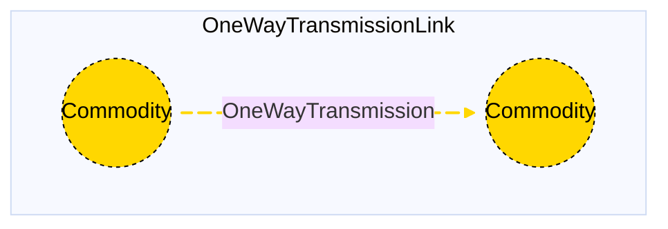

# One-way Transmission Link

## Contents

[Overview](@ref onewaytransmissionlink_overview) | [Asset Structure](@ref onewaytransmissionlink_asset_structure) | [Input File (Standard Format)](@ref onewaytransmissionlink_input_file) | [Types - Asset Structure](@ref onewaytransmissionlink_type_definition) | [Constructors](@ref onewaytransmissionlink_constructors) | [Examples](@ref onewaytransmissionlink_examples) | [Best Practices](@ref onewaytransmissionlink_best_practices) | [Input File (Advanced Format)](@ref onewaytransmissionlink_advanced_json_csv_input_format)

## [Overview](@id onewaytransmissionlink_overview)

One-way Transmission Link assets in Macro represent a unidirectional commodity transmission infrastructure that links a source node to a destination node. These assets are specified using JSON or CSV input files located in the `assets` directory, usually named with descriptive identifiers such as `oneway_transmissions.json` or `oneway_transmissions.csv`.

## [Asset Structure](@id onewaytransmissionlink_asset_structure)

A One-way Transmission Link asset consists of one main component:

1. **Transmission Edge**: Represents the unidirectional flow of a commodity from a start node to an end node with capacity constraints and losses

Here is a simple graphical representation of the One-way Transmission Link asset:



## [Input File (Standard Format)](@id onewaytransmissionlink_input_file)

The easiest way to include a One-way Transmission Link asset in a model is to create a new file (either JSON or CSV) and place it in the `assets` directory together with the other assets. 

```
your_case/
├── assets/
│   ├── oneway_transmissions.json    # or oneway_transmissions.csv
│   ├── other_assets.json
│   └── ...
├── system/
├── settings/
└── ...
```

This file can either be created manually, or using the `template_asset` function. The file will be automatically loaded when you run your Macro model. 

The following is an example of a One-way Transmission Link asset input file:
```json
{
    "link": [
        {
            "type": "OneWayTransmissionLink",
            "instance_data": [
                {
                    "id": "SE_to_MIDAT_oneway",
                    "commodity": "Electricity",
                    "transmission_origin": "elec_SE",
                    "transmission_dest": "elec_MIDAT",
                    "distance": 491.4512001,
                    "existing_capacity": 5552,
                    "max_capacity": 27760,
                    "investment_cost": 40219,
                    "loss_fraction": 0.04914512,
                    "transmission_constraints": {
                        "MaxCapacityConstraint": true
                    }
                }
            ]
        }
    ]
}
```

!!! tip "Global Data vs Instance Data"
    When working with JSON input files, the `global_data` field can be used to group data that is common to all instances of the same asset type. This is useful for setting constraints that are common to all instances of the same asset type and avoid repeating the same data for each instance.

### Essential Attributes
| Field | Type | Description |
|--------------|---------|------------|
| `type` | String | Asset type identifier: "OneWayTransmissionLink" |
| `id` | String | Unique identifier for the One-way Transmission Link instance |
| `commodity` | String | Commodity type being transmitted (e.g., "Electricity") |
| `transmission_origin` | String | Origin node identifier |
| `transmission_dest` | String | Destination node identifier |

### [Constraints configuration](@id onewaytransmissionlink_constraints)
One-way Transmission Link assets can have different constraints applied to them, and the user can configure them using the following fields:

| Field | Type | Description |
|--------------|---------|------------|
| `transmission_constraints` | Dict{String,Bool} | List of constraints applied to the transmission edge. |

Users can refer to the [Adding Asset Constraints to a System](@ref) section of the User Guide for a list of all the constraints that can be applied to a transmission edge.

#### Default constraints
To simplify the input file and the asset configuration, the following constraints are applied to the One-way Transmission Link asset by default:

- [Capacity constraint](@ref capacity_constraint_ref) (applied to the transmission edge)

### Investment Parameters
| Field | Type | Description | Units | Default |
|--------------|---------|------------|----------------|----------|
| `can_retire` | Boolean | Whether capacity can be retired | - | false |
| `can_expand` | Boolean | Whether capacity can be expanded | - | true |
| `existing_capacity` | Float64 | Initial installed capacity | MW | 0.0 |
| `capacity_size` | Float64 | Unit size for capacity decisions | - | 1.0 |

#### Additional Investment Parameters

**Maximum and minimum capacity constraints**

If [`MaxCapacityConstraint`](@ref max_capacity_constraint_ref) or [`MinCapacityConstraint`](@ref min_capacity_constraint_ref) are added to the constraints dictionary for the transmission edge, the following parameters are used by Macro:

| Field | Type | Description | Units | Default |
|--------------|---------|------------|----------------|----------|
| `max_capacity` | Float64 | Maximum allowed capacity | MW | Inf |
| `min_capacity` | Float64 | Minimum allowed capacity | MW | 0.0 |

### Economic Parameters
| Field | Type | Description | Units | Default |
|--------------|---------|------------|----------------|----------|
| `investment_cost` | Float64 | CAPEX per unit capacity | $/MW | 0.0 |
| `annualized_investment_cost` | Union{Nothing,Float64} | Annualized CAPEX | $/MW/yr | calculated |
| `fixed_om_cost` | Float64 | Fixed O&M costs | $/MW/yr | 0.0 |
| `variable_om_cost` | Float64 | Variable O&M costs | $/MWh | 0.0 |
| `wacc` | Float64 | Weighted average cost of capital | fraction | 0.0 |
| `lifetime` | Int | Asset lifetime in years | years | 1 |
| `capital_recovery_period` | Int | Investment recovery period | years | 1 |
| `retirement_period` | Int | Retirement period | years | 0 |

### Operational Parameters
| Field | Type | Description | Units | Default |
|--------------|---------|------------|----------------|----------|
| `distance` | Float64 | Distance between nodes | km | 0.0 |
| `loss_fraction` | Float64 | Fraction of power lost during transmission | fraction | 0.0 |
| `unidirectional` | Boolean | Whether the transmission is unidirectional | - | true |

## [Types - Asset Structure](@id onewaytransmissionlink_type_definition)

The `OneWayTransmissionLink` asset is defined as follows:

```julia
struct OneWayTransmissionLink{T} <: AbstractAsset
    id::AssetId
    transmission_edge::UnidirectionalEdge{<:T}
end
```

## [Constructors](@id onewaytransmissionlink_constructors)

### Default constructor

```julia
OneWayTransmissionLink(id::AssetId, transmission_edge::UnidirectionalEdge{<:T})
```

### Factory constructor
```julia
make(asset_type::Type{OneWayTransmissionLink}, data::AbstractDict{Symbol,Any}, system::System)
```

| Field | Type | Description |
|--------------|---------|------------|
| `asset_type` | `Type{OneWayTransmissionLink}` | Macro type of the asset |
| `data` | `AbstractDict{Symbol,Any}` | Dictionary containing the input data for the asset |
| `system` | `System` | System to which the asset belongs |

## [Examples](@id onewaytransmissionlink_examples)
This section contains examples of how to use the One-way Transmission Link asset in a Macro model.

### Single one-way transmission link between zones

**JSON Format:**

```json
{
    "link": [
        {
            "type": "OneWayTransmissionLink",
            "global_data": {
                "transmission_constraints": {
                    "MaxCapacityConstraint": true
                }
            },
            "instance_data": [
                {
                    "id": "SE_to_MIDAT_oneway",
                    "commodity": "Electricity",
                    "transmission_origin": "elec_SE",
                    "transmission_dest": "elec_MIDAT",
                    "distance": 491.4512001,
                    "existing_capacity": 5552,
                    "max_capacity": 27760,
                    "investment_cost": 40219,
                    "loss_fraction": 0.04914512
                }
            ]
        }
    ]
}
```

**CSV Format:**

| Type | id | commodity | transmission\_origin | transmission\_dest | distance | existing\_capacity | max\_capacity | investment\_cost | loss\_fraction | transmission\_constraints--MaxCapacityConstraint |
|------|----|-----------|---------------------|-------------------|----------|-------------------|---------------|------------------|----------------|--------------------------------------------------|
| OneWayTransmissionLink | SE\_to\_MIDAT\_oneway | Electricity | elec\_SE | elec\_MIDAT | 491.4512001 | 5552 | 27760 | 40219 | 0.04914512 | true |

## [Best Practices](@id onewaytransmissionlink_best_practices)

- Prefer `global_data` for shared fields and constraints across instances.
- Ensure `loss_fraction` reflects realistic transmission losses for the distance and technology used.
- Use descriptive IDs that indicate origin and destination.
- Validate capacity-related cost and technology parameters before large-scale runs.

## [Input File (Advanced Format)](@id onewaytransmissionlink_advanced_json_csv_input_format)

The advanced format mirrors the asset's hierarchical structure. A One-way Transmission Link asset is composed of a single transmission edge, represented by a `UnidirectionalEdge` object. The input file is therefore organized as follows:

```json
{
    "edges": {
        "transmission_edge": {
            // ... transmission_edge-specific attributes ...
        }
    }
}
```

Below is an example of an input file using the advanced format for a One-way Transmission Link asset.

```json
{
    "link": [
        {
            "type": "OneWayTransmissionLink",
            "global_data": {
                "edges": {
                    "transmission_edge": {
                        "commodity": "Electricity",
                        "has_capacity": true,
                        "unidirectional": true,
                        "can_expand": true,
                        "can_retire": false,
                        "integer_decisions": false,
                        "constraints": {
                            "CapacityConstraint": true,
                            "MaxCapacityConstraint": true
                        }
                    }
                }
            },
            "instance_data": [
                {
                    "id": "SE_to_MIDAT_oneway",
                    "edges": {
                        "transmission_edge": {
                            "start_vertex": "elec_SE",
                            "end_vertex": "elec_MIDAT",
                            "distance": 491.4512001,
                            "existing_capacity": 5552,
                            "max_capacity": 27760,
                            "investment_cost": 40219,
                            "loss_fraction": 0.04914512
                        }
                    }
                }
            ]
        }
    ]
}
```

### Key Points

- The `global_data` field is utilized to define attributes and constraints that apply universally to all instances of a particular asset type.
- The `start_vertex` and `end_vertex` fields indicate the nodes to which the transmission edge is connected. These nodes must be defined in the `nodes.json` file.
- For a comprehensive list of attributes that can be configured for the edge component, refer to the [edges](@ref manual-edges-fields) page of the Macro manual.
