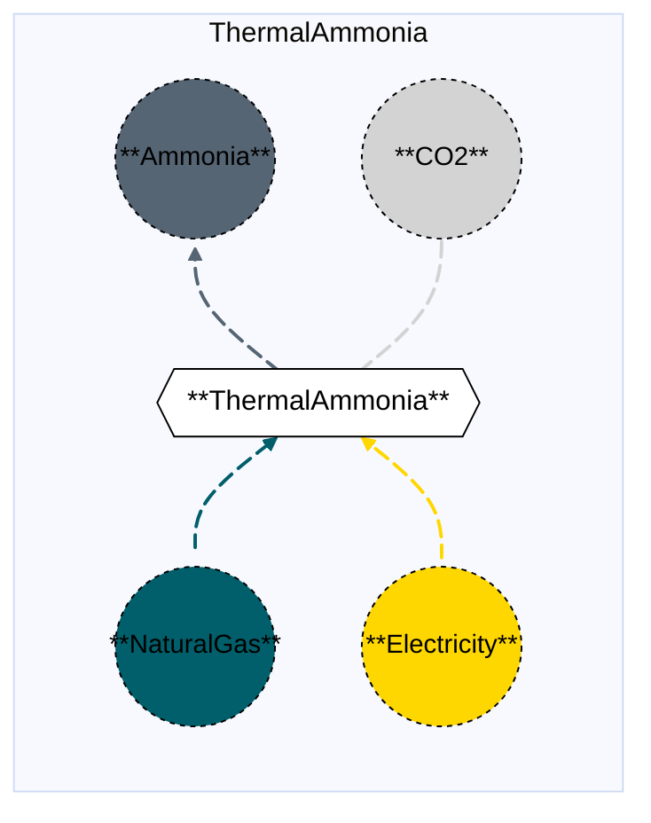
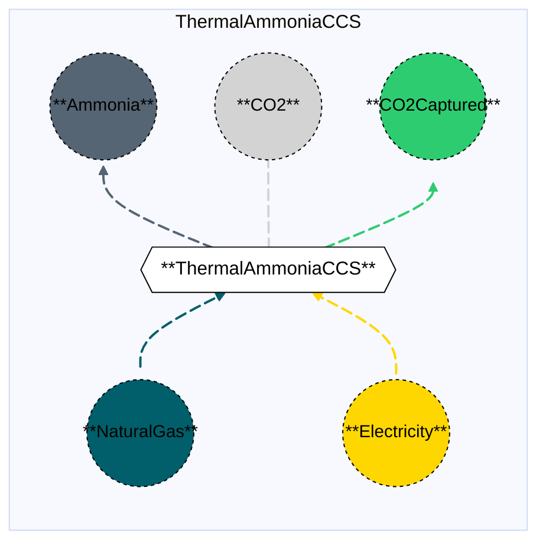

# Thermal Ammonia (with and without CCS)

## Contents

[Overview](@ref thermalammonia_overview) | [Asset Structure](@ref thermalammonia_asset_structure) | [Flow Equations](@ref thermalammonia_flow_equations) | [Input File (Standard Format)](@ref thermalammonia_input_file) | [Types - Asset Structure](@ref thermalammonia_type_definition) | [Constructors](@ref thermalammonia_constructors) | [Examples](@ref thermalammonia_examples)

## [Overview](@id thermalammonia_overview)

In Macro, the Thermal Ammonia pathway represents natural gas-based ammonia production facilities using the Haber-Bosch process. This technology uses natural gas (or other fossil fuels) as a feedstock to produce ammonia through steam methane reforming, followed by the Haber-Bosch synthesis reaction. The process consumes electricity and natural gas, and emits CO₂ as a byproduct.

Two variants are available:
- **Thermal Ammonia (without CCS)**: Standard thermal ammonia production with direct CO₂ emissions.
- **Thermal Ammonia with CCS**: Thermal ammonia production with carbon capture and storage (CCS) technology, capturing approximately 95% of CO₂ emissions. This variant consumes more electricity due to the energy requirements of the capture process.

These assets are defined using either JSON or CSV input files placed in the `assets` directory, typically named with descriptive identifiers like `thermal_ammonia.json` or `thermal_ammonia_ccs.json`.

## [Asset Structure](@id thermalammonia_asset_structure)

A Thermal Ammonia plant (with and without CCS) is made of the following components:
- 1 `Transformation` component, representing the thermal ammonia production process (with or without CCS).
- 4-5 `Edge` components (depending on CCS variant):
    - 1 **incoming** `Fuel Edge`, representing natural gas (or other fuel) supply. The fuel commodity type can be specified (e.g., NaturalGas, Hydrogen).
    - 1 **incoming** `Electricity Edge`, representing electricity consumption.
    - 1 **outgoing** `Ammonia Edge`, representing ammonia production.
    - 1 **outgoing** `CO₂ Edge`, representing CO₂ emissions (residual emissions for CCS variant).
    - 1 **outgoing** `CO₂Captured Edge`, representing captured CO₂ **(only if CCS is present)**.

Here is a graphical representation of the Thermal Ammonia asset without CCS:



Here is a graphical representation of the Thermal Ammonia asset with CCS:



## [Flow Equations](@id thermalammonia_flow_equations)

The Thermal Ammonia asset (with and without CCS) follows these stoichiometric relationships:

**Without CCS:**
```math
\begin{aligned}
\phi_{fuel} &= \phi_{nh3} \cdot \epsilon_{fuel\_consumption} \\
\phi_{elec} &= \phi_{nh3} \cdot \epsilon_{electricity\_consumption} \\
\phi_{co2} &= \phi_{fuel} \cdot \epsilon_{emission\_rate} \\
\end{aligned}
```

**With CCS:**
```math
\begin{aligned}
\phi_{fuel} &= \phi_{nh3} \cdot \epsilon_{fuel\_consumption} \\
\phi_{elec} &= \phi_{nh3} \cdot \epsilon_{electricity\_consumption} \\
\phi_{co2} &= \phi_{fuel} \cdot \epsilon_{emission\_rate} \\
\phi_{co2\_captured} &= \phi_{fuel} \cdot \epsilon_{capture\_rate} \\
\end{aligned}
```

Where:
- ``\phi`` represents the flow of each commodity
- ``\epsilon`` represents the stoichiometric coefficients defined in the [Conversion Process Parameters](@ref thermalammonia_conversion_process_parameters) section.

## [Input File (Standard Format)](@id thermalammonia_input_file)

The easiest way to include a Thermal Ammonia asset in a model is to create a new file (either JSON or CSV) and place it in the `assets` directory together with the other assets. 

```
your_case/
├── assets/
│   ├── thermal_ammonia.json    # or thermal_ammonia.csv (without CCS)
│   ├── thermal_ammonia_ccs.json    # or thermal_ammonia_ccs.csv (with CCS)
│   ├── other_assets.json
│   └── ...
├── system/
├── settings/
└── ...
```

This file can either be created manually, or using the `template_asset` function, as shown in the [Adding an Asset to a System](@ref) section of the User Guide. The file will be automatically loaded when you run your Macro model. Examples of input JSON files are shown in the [Examples](@ref thermalammonia_examples) section.

The following tables outline the attributes that can be set for a Thermal Ammonia asset.

### Transform Attributes
#### Essential Attributes
| Field | Type | Description |
|--------------|---------|------------|
| `Type` | String | Asset type identifier: "ThermalAmmonia" or "ThermalAmmoniaCCS" |
| `id` | String | Unique identifier for the asset instance |
| `location` | String | Geographic location/node identifier |
| `timedata` | String | Time resolution for the time series data linked to the transformation |

#### [Conversion Process Parameters](@id thermalammonia_conversion_process_parameters)
| Field | Type | Description | Units | Default (without CCS) | Default (with CCS) |
|--------------|---------|------------|----------------|----------------------|-------------------|
| `fuel_consumption` | Float64 | Fuel consumption per MWh of ammonia output | $MWh_{fuel}/MWh_{NH_3}$ | 0.0 | 0.0 |
| `electricity_consumption` | Float64 | Electricity consumption per MWh of ammonia output | $MWh_{elec}/MWh_{NH_3}$ | 0.0 | 0.0 |
| `emission_rate` | Float64 | CO₂ emissions per MWh of fuel input | $t_{CO_2}/MWh_{fuel}$ | 0.0 | 0.0 |
| `capture_rate` | Float64 | CO₂ capture rate per MWh of fuel input **(CCS only)** | $t_{CO_2}/MWh_{fuel}$ | - | 0.0 |

#### General Attributes

| Field | Type | Values | Default | Description |
|:--------------| :------: |:------: | :------: |:-------|
| `type` | `String` | Any Macro commodity type matching the commodity of the edge | Required | Commodity of the edge. E.g. "Electricity". |
| `start_vertex` | `String` | Any node id present in the system matching the commodity of the edge | Required | ID of the starting vertex of the edge. The node must be present in the `nodes.json` file. E.g. "elec\_node\_1". |
| `end_vertex` | `String` | Any node id present in the system matching the commodity of the edge | Required | ID of the ending vertex of the edge. The node must be present in the `nodes.json` file. E.g. "nh3\_node\_1". |
| `availability` | `Dict` | Availability file path and header | Empty | Path to the availability file and column name for the availability time series to link to the edge. E.g. `{"timeseries": {"path": "assets/availability.csv", "header": "ThermalAmmonia"}}`.|
| `has_capacity` | `Bool` | `Bool` | `false` | Whether capacity variables are created for the edge. |
| `integer_decisions` | `Bool` | `Bool` | `false` | Whether capacity variables are integers. |
| `unidirectional` | `Bool` | `Bool` | `false` | Whether the edge is unidirectional. |

!!! warning "Asset expansion"
    As a modeling decision, only the `Ammonia` edge is allowed to expand. Therefore, both the `has_capacity` and `constraints` attributes can only be set for that edge. For all other edges, these attributes are pre-set to `false` and an empty list, respectively, to ensure the correct modeling of the asset. 

!!! warning "Unit Commitment"
    The `nh3_edge` can optionally support unit commitment constraints. If `uc` is set to `true` in the edge data, the edge will be created as an `EdgeWithUC` type, and unit commitment constraints (MinUpTimeConstraint, MinDownTimeConstraint) will be automatically applied.

#### Investment Parameters
| Field | Type | Description | Units | Default |
|--------------|---------|------------|----------------|----------|
| `can_retire` | Boolean | Whether capacity can be retired | - | true |
| `can_expand` | Boolean | Whether capacity can be expanded | - | true |
| `existing_capacity` | Float64 | Initial installed capacity | MWh NH₃ | 0.0 |

#### Economic Parameters
| Field | Type | Description | Units | Default (without CCS) | Default (with CCS) |
|--------------|---------|------------|----------------|----------------------|-------------------|
| `investment_cost` | Float64 | CAPEX per unit capacity | \$/MW | 0.0 | 0.0 |
| `fixed_om_cost` | Float64 | Fixed O&M costs | \$/MW-yr | 0.0 | 0.0 |
| `variable_om_cost` | Float64 | Variable O&M costs | \$/MWh NH₃ | 0.0 | 0.0 |

### [Constraints Configuration](@id thermalammonia_constraints)

Thermal Ammonia assets can have different constraints applied to them, and the user can configure them using the following fields:

| Field | Type | Description |
|--------------|---------|------------|
| `transform_constraints` | Dict{String,Bool} | List of constraints applied to the transformation component. |
| `output_constraints` | Dict{String,Bool} | List of constraints applied to the output edge component. |

For example, if the user wants to apply the [`BalanceConstraint`](@ref balance_constraint_ref) to the transformation component and the [`CapacityConstraint`](@ref capacity_constraint_ref) to the output edge, the constraints fields should be set as follows:

```json
{
    "transform_constraints": {
        "BalanceConstraint": true
    },
    "edges":{
        "nh3_edge": {
            "constraints": {
                "CapacityConstraint": true,
                "RampingLimitConstraint": true
            }
        }
    }
}
```

Users can refer to the [Adding Asset Constraints to a System](@ref) section of the User Guide for a list of all the constraints that can be applied to the different components of a Thermal Ammonia asset.

#### Default constraints
To simplify the input file and the asset configuration, the following constraints are applied to the Thermal Ammonia asset by default:

- [Balance constraint](@ref balance_constraint_ref) (applied to the transformation component)
- [Capacity constraint](@ref capacity_constraint_ref) (applied to the output ammonia edge)
- [Ramping limits constraint](@ref ramping_limits_constraint_ref) (applied to the output ammonia edge)

## [Types - Asset Structure](@id thermalammonia_type_definition)

The Thermal Ammonia asset (without CCS) is defined as follows:

```julia
struct ThermalAmmonia{T} <: AbstractAsset
    id::AssetId
    thermalammonia_transform::Transformation
    nh3_edge::Union{UnidirectionalEdge{<:Ammonia},EdgeWithUC{<:Ammonia}}
    elec_edge::UnidirectionalEdge{<:Electricity}
    fuel_edge::UnidirectionalEdge{<:T}
    co2_edge::UnidirectionalEdge{<:CO2}
end
```

The Thermal Ammonia with CCS asset is defined as follows:

```julia
struct ThermalAmmoniaCCS{T} <: AbstractAsset
    id::AssetId
    thermalammoniaccs_transform::Transformation
    nh3_edge::Union{UnidirectionalEdge{<:Ammonia},EdgeWithUC{<:Ammonia}}
    elec_edge::UnidirectionalEdge{<:Electricity}
    fuel_edge::UnidirectionalEdge{<:T}
    co2_edge::UnidirectionalEdge{<:CO2}
    co2_captured_edge::UnidirectionalEdge{<:CO2Captured}
end
```

Where `T` is a generic type parameter that can be any `Commodity` type (typically `NaturalGas`).

## [Constructors](@id thermalammonia_constructors)

### Factory constructor (without CCS)
```julia
make(asset_type::Type{ThermalAmmonia}, data::AbstractDict{Symbol,Any}, system::System)
```

### Factory constructor (with CCS)
```julia
make(asset_type::Type{ThermalAmmoniaCCS}, data::AbstractDict{Symbol,Any}, system::System)
```

| Field | Type | Description |
|--------------|---------|------------|
| `asset_type` | `Type{ThermalAmmonia}` or `Type{ThermalAmmoniaCCS}` | Macro type of the asset |
| `data` | `AbstractDict{Symbol,Any}` | Dictionary containing the input data for the asset |
| `system` | `System` | System to which the asset belongs |

### Stoichiometry balance data (without CCS)

```julia
thermalammonia_transform.balance_data = Dict(
    :energy => Dict(
        nh3_edge.id => get(transform_data, :fuel_consumption, 0.0),
        fuel_edge.id => 1.0,
    ),
    :electricity => Dict(
        nh3_edge.id => get(transform_data, :electricity_consumption, 0.0),
        elec_edge.id => 1.0
    ),
    :emissions => Dict(
        fuel_edge.id => get(transform_data, :emission_rate, 0.0),
        co2_edge.id => 1.0,
    ),
)
```

### Stoichiometry balance data (with CCS)

```julia
thermalammoniaccs_transform.balance_data = Dict(
    :energy => Dict(
        nh3_edge.id => get(transform_data, :fuel_consumption, 0.0),
        fuel_edge.id => 1.0,
    ),
    :electricity => Dict(
        nh3_edge.id => get(transform_data, :electricity_consumption, 0.0),
        elec_edge.id => 1.0
    ),
    :emissions => Dict(
        fuel_edge.id => get(transform_data, :emission_rate, 0.0),
        co2_edge.id => 1.0,
    ),
    :capture => Dict(
        fuel_edge.id => get(transform_data, :capture_rate, 0.0),
        co2_captured_edge.id => 1.0,
    ),
)
```

!!! warning "Dictionary keys must match"
    In the code above, each `get` function call looks up a parameter in the `transform_data` dictionary using a symbolic key such as `:fuel_consumption` or `:capture_rate`.
    These keys **must exactly match** the corresponding field names in your input asset `.json` or `.csv` files. Mismatched key names between the constructor file and the asset input will result in missing or incorrect parameter values (defaulting to the values shown above).

## [Examples](@id thermalammonia_examples)

### Example 1: Thermal Ammonia without CCS

This example illustrates a basic Thermal Ammonia configuration (without CCS) in JSON format:

```json
{
    "ThermalAmmonia": [
        {
            "type": "ThermalAmmonia",
            "global_data":{
                "nodes": {},
                "transforms": {
                    "timedata": "Ammonia"
                },
                "edges":{
                    "nh3_edge": {
                        "commodity": "Ammonia",
                        "unidirectional": true,
                        "has_capacity": true,
                        "can_retire": true,
                        "can_expand": true,
                        "integer_decisions": false
                    },
                    "elec_edge": {
                        "commodity": "Electricity",
                        "unidirectional": true,
                        "has_capacity": false
                    },
                    "fuel_edge": {
                        "commodity": "NaturalGas",
                        "unidirectional": true,
                        "has_capacity": false
                    },
                    "co2_edge": {
                        "commodity": "CO2",
                        "unidirectional": true,
                        "has_capacity": false,
                        "end_vertex": "co2_sink"
                    }
                }
            },
            "instance_data":[
                {
                    "id": "thermal_ammonia_1",
                    "transforms":{
                        "fuel_consumption": 1.3095,
                        "electricity_consumption": 0.03787,
                        "emission_rate": 0.181048235160161
                    },
                    "edges":{
                        "nh3_edge": {
                            "end_vertex": "nh3_node_1",
                            "existing_capacity": 0.0,
                            "investment_cost": 2093045.41,
                            "fixed_om_cost": 84025.0649,
                            "variable_om_cost": 0.9015
                        },
                        "elec_edge": {
                            "start_vertex": "elec_node_1"
                        },
                        "fuel_edge": {
                            "start_vertex": "natgas_node_1"
                        },
                        "co2_edge": {
                            "end_vertex": "co2_sink"
                        }
                    }
                }
            ]
        }
    ]
}
```

### Example 2: Thermal Ammonia with CCS

This example illustrates a basic Thermal Ammonia with CCS configuration in JSON format:

```json
{
    "ThermalAmmoniaCCS": [
        {
            "type": "ThermalAmmoniaCCS",
            "global_data":{
                "nodes": {},
                "transforms": {
                    "timedata": "Ammonia"
                },
                "edges":{
                    "nh3_edge": {
                        "commodity": "Ammonia",
                        "unidirectional": true,
                        "has_capacity": true,
                        "can_retire": true,
                        "can_expand": true,
                        "integer_decisions": false
                    },
                    "elec_edge": {
                        "commodity": "Electricity",
                        "unidirectional": true,
                        "has_capacity": false
                    },
                    "fuel_edge": {
                        "commodity": "NaturalGas",
                        "unidirectional": true,
                        "has_capacity": false
                    },
                    "co2_edge": {
                        "commodity": "CO2",
                        "unidirectional": true,
                        "has_capacity": false,
                        "end_vertex": "co2_sink"
                    },
                    "co2_captured_edge": {
                        "commodity": "CO2Captured",
                        "unidirectional": true,
                        "has_capacity": false
                    }
                }
            },
            "instance_data":[
                {
                    "id": "thermal_ammonia_ccs_1",
                    "transforms":{
                        "fuel_consumption": 1.3095,
                        "electricity_consumption": 0.07342,
                        "emission_rate": 0.0091,
                        "capture_rate": 0.17195
                    },
                    "edges":{
                        "nh3_edge": {
                            "end_vertex": "nh3_node_1",
                            "existing_capacity": 0.0,
                            "investment_cost": 2720959.03,
                            "fixed_om_cost": 109232.584,
                            "variable_om_cost": 1.17195
                        },
                        "elec_edge": {
                            "start_vertex": "elec_node_1"
                        },
                        "fuel_edge": {
                            "start_vertex": "natgas_node_1"
                        },
                        "co2_edge": {
                            "end_vertex": "co2_sink"
                        },
                        "co2_captured_edge": {
                            "end_vertex": "co2_captured_node_1"
                        }
                    }
                }
            ]
        }
    ]
}
```

## See Also

- [Edges](@ref) - Components that connect Vertices and carry flows
- [Transformations](@ref) - Processes that transform flows of several Commodities
- [Nodes](@ref) - Network nodes that allow for import and export of commodities
- [Vertices](@ref) - Network nodes that edges connect
- [Assets](@ref "Assets") - Higher-level components made from edges, nodes, storage, and transformations
- [Commodities](@ref) - Types of resources stored by Commodities
- [Time Data](@ref) - Temporal modeling framework
- [Constraints](@ref) - Additional constraints for Storage and other components
- [Synthetic Ammonia](@ref syntheticammonia_overview) - Electrochemical ammonia production
