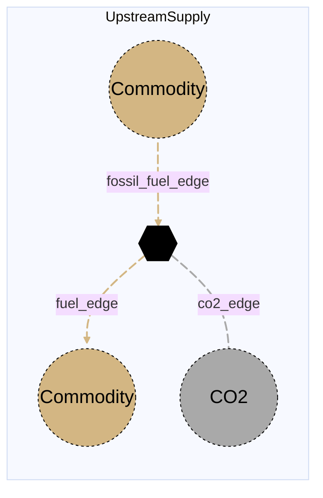

# Upstream Supply

## Contents

[Overview](@ref upstreamsupply_overview) | [Asset Structure](@ref upstreamsupply_asset_structure) | [Flow Equations](@ref upstreamsupply_flow_equations) | [Input File (Standard Format)](@ref upstreamsupply_input_file) | [Types - Asset Structure](@ref upstreamsupply_type_definition) | [Constructors](@ref upstreamsupply_constructors) | [Examples](@ref upstreamsupply_examples) | [Best Practices](@ref upstreamsupply_best_practices) | [Input File (Advanced Format)](@ref upstreamsupply_advanced_json_csv_input_format)

## [Overview](@id upstreamsupply_overview)

Upstream supply assets in Macro represent commodity supply processes at the upstream end of a value chain. They take in a source commodity, pass that commodity into the modeled system, and optionally emit CO2 according to an `emission_rate`. These assets are defined using either JSON or CSV input files placed in the `assets` directory, typically named with descriptive identifiers like `upstreamsupply.json` or `upstreamsupply.csv`.

The current implementation is generic over commodity type, so the same asset can represent upstream supply of liquid fuels, natural gas, or other commodities supported by the model.

For backward compatibility, `FossilFuelsUpstream` remains available as an alias of `UpstreamSupply`.

## [Asset Structure](@id upstreamsupply_asset_structure)

An upstream supply asset consists of four main components:

1. **Transformation Component**: Balances commodity throughput and emissions
2. **Source Commodity Edge**: Represents the incoming upstream commodity flow
3. **Delivered Commodity Edge**: Represents the outgoing commodity flow into the modeled system
4. **CO2 Edge**: Represents emitted CO2 sent to a sink or location

Here is a graphical representation of the upstream supply asset:



## [Flow Equations](@id upstreamsupply_flow_equations)

The upstream supply asset follows these relationships:

```math
\begin{aligned}
\text{flow}_{fuel} &= \text{flow}_{source} \\
\text{flow}_{co2} &= \text{flow}_{source} \cdot \epsilon_{emission\_rate}
\end{aligned}
```

Where:
- `flow` represents the flow of each commodity
- ``\epsilon`` represents the emission coefficient defined in the [Conversion Process Parameters](@ref upstreamsupply_conversion_process_parameters) section

## [Input File (Standard Format)](@id upstreamsupply_input_file)

The easiest way to include an upstream supply asset in a model is to create a new file (either JSON or CSV) and place it in the `assets` directory together with the other assets.

```
your_case/
├── assets/
│   ├── upstreamsupply.json    # or upstreamsupply.csv
│   ├── other_assets.json
│   └── ...
├── system/
├── settings/
└── ...
```

This file can either be created manually, or using the `template_asset` function, as shown in the [Adding an Asset to a System](@ref) section of the User Guide. The file will be automatically loaded when you run your Macro model.

The following is an example of an upstream supply asset input file:

```json
{
    "upstream_supply": [
        {
            "type": "UpstreamSupply",
            "instance_data": [
                {
                    "id": "liquid_fuels_supply_SE",
                    "location": "SE",
                    "fuel_commodity": "LiquidFuels",
                    "fossil_fuel_commodity": "LiquidFuels",
                    "emission_rate": 0.25,
                    "fuel_investment_cost": 2500,
                    "fuel_fixed_om_cost": 100,
                    "fuel_variable_om_cost": 2.0,
                    "co2_sink": "co2_atm_SE"
                }
            ]
        }
    ]
}
```

!!! tip "Global Data vs Instance Data"
    When working with JSON input files, the `global_data` field can be used to group data that is common to all instances of the same asset type. This is useful for setting constraints that are common to all instances of the same asset type and avoid repeating the same data for each instance. See the [Examples](@ref "upstreamsupply_examples") section below for an example.

The following tables outline the attributes that can be set for an upstream supply asset.

### Essential Attributes
| Field | Type | Description |
|--------------|---------|------------|
| `type` | String | Asset type identifier: "UpstreamSupply" |
| `id` | String | Unique identifier for the upstream supply instance |
| `location` | String | Geographic location/node identifier |

### [Conversion Process Parameters](@id upstreamsupply_conversion_process_parameters)
| Field | Type | Description | Units | Default |
|--------------|---------|------------|----------------|----------|
| `emission_rate` | Float64 | CO2 emissions per unit of source commodity throughput | commodity-dependent | 0.0 |
| `fuel_commodity` | String | Commodity delivered by the `fuel_edge` | - | missing |
| `fossil_fuel_commodity` | String | Commodity consumed by the `fossil_fuel_edge` | - | missing |
| `co2_sink` | String | End vertex for emitted CO2 | - | missing |

Simple-format edge attributes use edge-specific prefixes. For example, delivered commodity edge fields are written as `fuel_investment_cost`, `fuel_existing_capacity`, and `fuel_constraints`; source commodity edge fields use the `fossil_fuel_` prefix; and CO2 edge fields use the `co2_` prefix.

### [Constraints Configuration](@id "upstreamsupply_constraints")
Upstream supply assets can have different constraints applied to them, and the user can configure them using the following fields:

| Field | Type | Description |
|--------------|---------|------------|
| `transform_constraints` | Dict{String,Bool} | List of constraints applied to the transformation component. |
| `fuel_constraints` | Dict{String,Bool} | List of constraints applied to the delivered commodity edge. |
| `fossil_fuel_constraints` | Dict{String,Bool} | List of constraints applied to the source commodity edge. |
| `co2_constraints` | Dict{String,Bool} | List of constraints applied to the CO2 edge. |

Users can refer to the [Adding Asset Constraints to a System](@ref) section of the User Guide for a list of all the constraints that can be applied to an upstream supply asset.

#### Default constraints
To simplify the input file and the asset configuration, the following constraints are applied to the upstream supply asset by default:

- [Balance constraint](@ref balance_constraint_ref) (applied to the transformation component)

### Investment Parameters
| Field | Type | Description | Units | Default |
|--------------|---------|------------|----------------|----------|
| `fuel_can_retire` | Boolean | Whether delivered commodity capacity can be retired | - | edge default |
| `fuel_can_expand` | Boolean | Whether delivered commodity capacity can be expanded | - | edge default |
| `fuel_existing_capacity` | Float64 | Initial installed delivered commodity capacity | MW or commodity flow per timestep | edge default |
| `fuel_capacity_size` | Float64 | Unit size for capacity decisions | - | edge default |

#### Additional Investment Parameters

**Maximum and minimum capacity constraints**

If [`MaxCapacityConstraint`](@ref max_capacity_constraint_ref) or [`MinCapacityConstraint`](@ref min_capacity_constraint_ref) are added to the constraints dictionary for the delivered commodity edge, the following parameters are used by Macro:

| Field | Type | Description | Units | Default |
|--------------|---------|------------|----------------|----------|
| `fuel_max_capacity` | Float64 | Maximum allowed delivered commodity capacity | MW or commodity flow per timestep | Inf |
| `fuel_min_capacity` | Float64 | Minimum allowed delivered commodity capacity | MW or commodity flow per timestep | 0.0 |

### Economic Parameters
| Field | Type | Description | Units | Default |
|--------------|---------|------------|----------------|----------|
| `fuel_investment_cost` | Float64 | CAPEX per unit delivered commodity capacity | \$/MW or \$/commodity-flow | edge default |
| `fuel_annualized_investment_cost` | Union{Nothing,Float64} | Annualized CAPEX | \$/MW/yr or \$/commodity-flow/yr | calculated |
| `fuel_fixed_om_cost` | Float64 | Fixed O&M costs for the delivered commodity edge | \$/MW/yr | edge default |
| `fuel_variable_om_cost` | Float64 | Variable O&M costs for the delivered commodity edge | \$/MWh or \$/commodity unit | edge default |
| `fuel_wacc` | Float64 | Weighted average cost of capital | fraction | edge default |
| `fuel_lifetime` | Int | Asset lifetime in years | years | edge default |
| `fuel_capital_recovery_period` | Int | Investment recovery period | years | edge default |
| `fuel_retirement_period` | Int | Retirement period | years | edge default |

### Operational Parameters
| Field | Type | Description | Units | Default |
|--------------|---------|------------|----------------|----------|
| `fuel_availability` | Dict | Availability file path and header for the delivered commodity edge | - | Empty |

#### Additional Operational Parameters

**Minimum flow constraint**

If [`MinFlowConstraint`](@ref min_flow_constraint_ref) is added to the constraints dictionary for the delivered commodity edge, the following parameter is used:

| Field | Type | Description | Units | Default |
|--------------|---------|------------|----------------|----------|
| `fuel_min_flow_fraction` | Float64 | Minimum delivered flow as fraction of capacity | fraction | 0.0 |

**Ramping limit constraint**

If [`RampingLimitConstraint`](@ref ramping_limits_constraint_ref) is added to the constraints dictionary for the delivered commodity edge, the following parameters are used:

| Field | Type | Description | Units | Default |
|--------------|---------|------------|----------------|----------|
| `fuel_ramp_up_fraction` | Float64 | Maximum increase in delivered flow between timesteps | fraction | 1.0 |
| `fuel_ramp_down_fraction` | Float64 | Maximum decrease in delivered flow between timesteps | fraction | 1.0 |

## [Types - Asset Structure](@id upstreamsupply_type_definition)

The `UpstreamSupply` asset is defined as follows:

```julia
struct UpstreamSupply{T} <: AbstractAsset
    id::AssetId
    fossilfuelsupstream_transform::Transformation
    fossil_fuel_edge::Edge{<:T}
    fuel_edge::Edge{<:T}
    co2_edge::Edge{<:CO2}
end

const FossilFuelsUpstream = UpstreamSupply
```

## [Constructors](@id upstreamsupply_constructors)

### Default constructors

```julia
UpstreamSupply(
    id::AssetId,
    fossilfuelsupstream_transform::Transformation,
    fossil_fuel_edge::Edge{<:T},
    fuel_edge::Edge{<:T},
    co2_edge::Edge{<:CO2}
) where {T<:LiquidFuels}

UpstreamSupply(
    id::AssetId,
    fossilfuelsupstream_transform::Transformation,
    fossil_fuel_edge::Edge{<:T},
    fuel_edge::Edge{T},
    co2_edge::Edge{<:CO2}
) where {T<:Commodity}
```

### Factory constructor
```julia
make(asset_type::Type{UpstreamSupply}, data::AbstractDict{Symbol,Any}, system::System)
```

| Field | Type | Description |
|--------------|---------|------------|
| `asset_type` | `Type{UpstreamSupply}` | Macro type of the asset |
| `data` | `AbstractDict{Symbol,Any}` | Dictionary containing the input data for the asset |
| `system` | `System` | System to which the asset belongs |

## [Examples](@id upstreamsupply_examples)

This section contains examples of how to use the upstream supply asset in a Macro model.

### Multiple upstream supply assets with shared defaults

This example shows how to create two upstream supply assets in different zones with shared global data and zone-specific `emission_rate` and cost assumptions.

**JSON Format:**

```json
{
    "upstream_supply": [
        {
            "type": "UpstreamSupply",
            "global_data": {
                "fuel_commodity": "NaturalGas",
                "fossil_fuel_commodity": "NaturalGas",
                "fuel_variable_om_cost": 1.0,
                "co2_sink": "co2_atm"
            },
            "instance_data": [
                {
                    "id": "natgas_supply_SE",
                    "location": "SE",
                    "emission_rate": 0.18,
                    "fuel_investment_cost": 1200,
                    "fuel_fixed_om_cost": 80
                },
                {
                    "id": "natgas_supply_NE",
                    "location": "NE",
                    "emission_rate": 0.16,
                    "fuel_investment_cost": 1500,
                    "fuel_fixed_om_cost": 95
                }
            ]
        }
    ]
}
```

**CSV Format:**

| Type | id | location | fuel_commodity | fossil_fuel_commodity | emission_rate | fuel_investment_cost | fuel_fixed_om_cost | fuel_variable_om_cost | co2_sink |
|------|----|----------|----------------|-----------------------|---------------|-----------------|---------------|------------------|----------|
| UpstreamSupply | natgas_supply_SE | SE | NaturalGas | NaturalGas | 0.18 | 1200 | 80 | 1.0 | co2_atm |
| UpstreamSupply | natgas_supply_NE | NE | NaturalGas | NaturalGas | 0.16 | 1500 | 95 | 1.0 | co2_atm |

## [Best Practices](@id upstreamsupply_best_practices)

1. Use explicit commodity names for both `fuel_commodity` and `fossil_fuel_commodity`, even when they are the same.
2. Set `co2_sink` explicitly when emissions should be routed to a dedicated CO2 node rather than the asset location.
3. Keep `emission_rate` units consistent with the commodity flow units used in the rest of the model.
4. Use `global_data` for shared cost and commodity settings when creating many upstream supply assets.
5. If this asset represents a physical import interface, apply capacity and ramping constraints on the delivered commodity edge rather than the transformation.

## [Input File (Advanced Format)](@id upstreamsupply_advanced_json_csv_input_format)

Macro provides an advanced format for defining upstream supply assets, offering users and modelers detailed control over transformation and edge specifications.

To understand the advanced format, consider the [graph representation](@ref upstreamsupply_asset_structure) and the [type definition](@ref upstreamsupply_type_definition) of an upstream supply asset. The input file mirrors this hierarchical structure.

An upstream supply asset in Macro is composed of a `Transformation` object and three `Edge` objects. The input file for an upstream supply asset is therefore organized as follows:

```json
{
    "transforms": {
        // ... transformation-specific attributes ...
    },
    "edges": {
        "fossil_fuel_edge": {
            // ... source commodity edge-specific attributes ...
        },
        "fuel_edge": {
            // ... delivered commodity edge-specific attributes ...
        },
        "co2_edge": {
            // ... CO2 edge-specific attributes ...
        }
    }
}
```

Below is an example of an advanced input file for an upstream supply asset:

```json
{
    "upstream_supply": [
        {
            "type": "UpstreamSupply",
            "instance_data": [
                {
                    "id": "liquid_fuels_supply_SE",
                    "location": "SE",
                    "transforms": {
                        "timedata": "LiquidFuels",
                        "emission_rate": 0.25,
                        "constraints": {
                            "BalanceConstraint": true
                        }
                    },
                    "edges": {
                        "fossil_fuel_edge": {
                            "commodity": "LiquidFuels",
                            "start_vertex": "liquid_fuels_source_SE"
                        },
                        "fuel_edge": {
                            "commodity": "LiquidFuels",
                            "end_vertex": "liquid_fuels_SE",
                            "investment_cost": 2500,
                            "fixed_om_cost": 100,
                            "variable_om_cost": 2.0
                        },
                        "co2_edge": {
                            "commodity": "CO2",
                            "end_vertex": "co2_atm_SE"
                        }
                    }
                }
            ]
        }
    ]
}
```

### Key Points

- The `transforms` block configures the internal transformation object, including `timedata`, `constraints`, and `emission_rate`.
- The `fossil_fuel_edge` and `fuel_edge` can be assigned any supported commodity type, allowing the asset to model upstream supply for multiple sectors.
- The `co2_edge` always uses the `CO2` commodity and can terminate either at `co2_sink` or at the asset `location`.
- For a comprehensive list of attributes that can be configured for edges and transformations, refer to the [edges](@ref manual-edges-fields) and [transformations](@ref manual-transformation-fields) pages of the Macro manual.